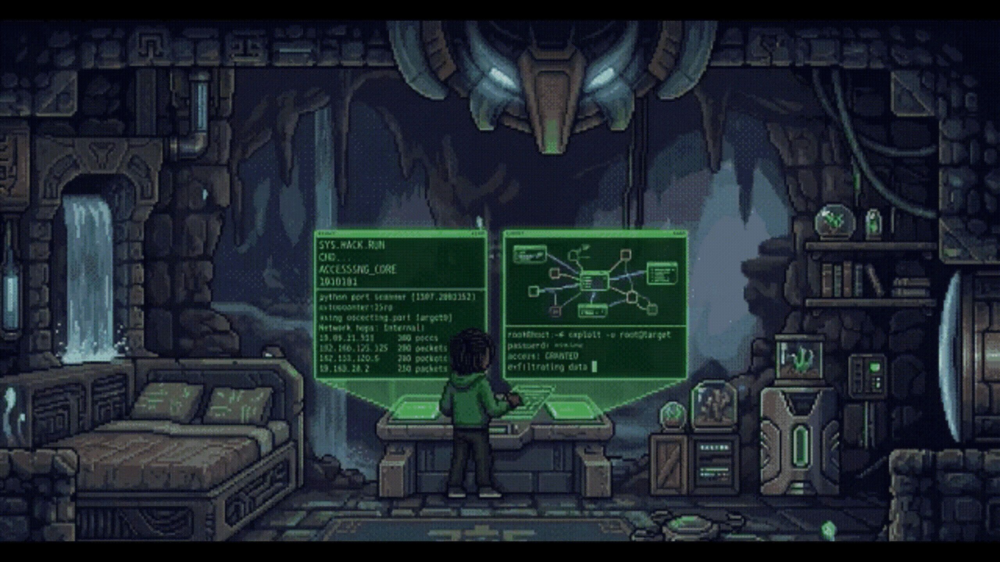
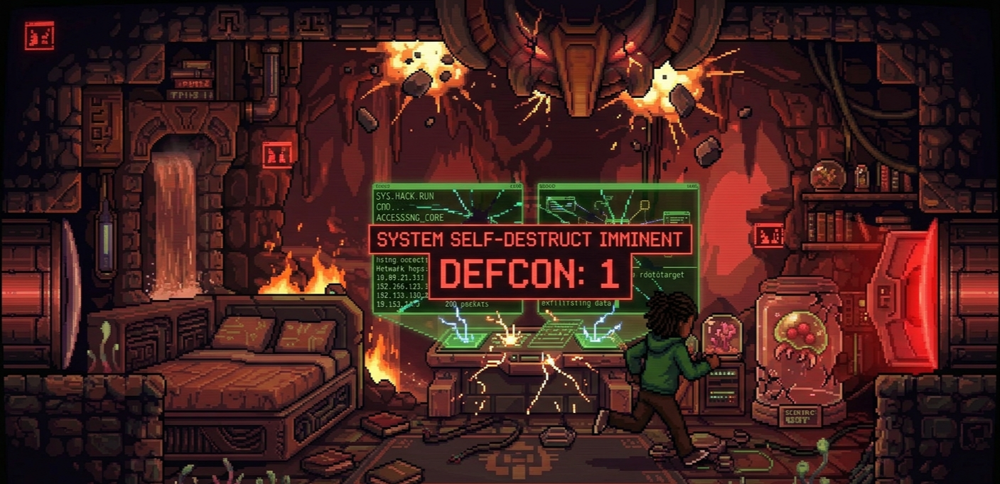

<h5 align="center"><b>🔒 Welcome to my dark side of the web!</b></h5> 

<div align="center">


[](https://git.io/typing-svg)
</div>

```bash
> connection established
$ whoami
intruder
```
 *Alright, let's go in! Let's see what's in this machine...💭*

```bash
$ tree
├── user
│   ├── profile.txt
│   └── skills
│       ├── languages.dat
│       └── interests.log
└── osint
    ├── target_list.txt
    └── enumerate.py
```
 *Interesting...*

```yaml
$ cat user/profile.txt
name: Davi_Nobre
role: Full_Stack_Developer
    "Passionate about all kinds of technology and currently studying Computer Science. 
    I enjoy building, exploring, and understanding how things work across the stack, driven by curiosity and new 
    challenges. Outside of coding, I’m a gamer at heart and enjoy reconnecting with nature. Want to know more about me?
    OSINT me… or die trying.."
    
$ cat user/skills/languages.dat
develop_skills: 
      - languages:     ['Java', 'Python', 'PHP', 'JavaScript', 'Bash', 'C/C++', 'HTML/CSS'...],
      - frameworks:    ['Laravel', 'Spring Boot', 'Angular', 'Express.js', 'React', 'Bootstrap', 'Flask'...],
      - databases:     ['PostgreSQL', 'MySQL', 'Redis', 'SQLite'...]
$ cat user/skills/interests.log
cybersecurity:
      - interests:     ['Offensive Security', 'Reverse Engineering','Network Analysis'...]
      - methodologies: ['OWASP', 'NIST', 'MITRE ATT&CK',...]
      - ctfs:          [...]

```

*Wait... Cyber security? too... Offensive... CTFs? no way!💭*<br>
*Let's check that OSINT directory, there might be something interesting there.*

```bash
$ cat osint/enumerate.py
#!/usr/bin/env python3
# OSINT enumeration utility
print("[*] Starting OSINT enumeration...")
```
*Enumeration script… this could reveal something useful. Lets check!💭*
```bash
python3 osint/enumerate.py
[*] Starting OSINT enumeration...
[+] Correlating targets...
[!] Intrusion detected!
[!] Nice try diddy!
[!] Honeypot activate!

FLAG{OSINT_ME_AND_DIE_TRYING}
                !!!CAUTION!!!
[!] DEFCON 4
[!] This system will be destroyed in 10 secs.
```
    
[](https://git.io/typing-svg)
    

*Oh Shi...! That was a trap! I gotta get out of here.*

<div align="center">


---

<h3>📊 GitHub Stats and Contributions</h3>


  
  
</div>


<h3 align="center">🌍 Contacs</h3>
<p align="center">
  <a href="https://www.linkedin.com/in/davi-nobre-57206b377/" target="_blank">
    
  </a>
  <a href="mailto:davi.nbtec@gmail.com">
    
  </a>
  <a href="https://github.com/davimalor3">
    
  </a>
</p>
